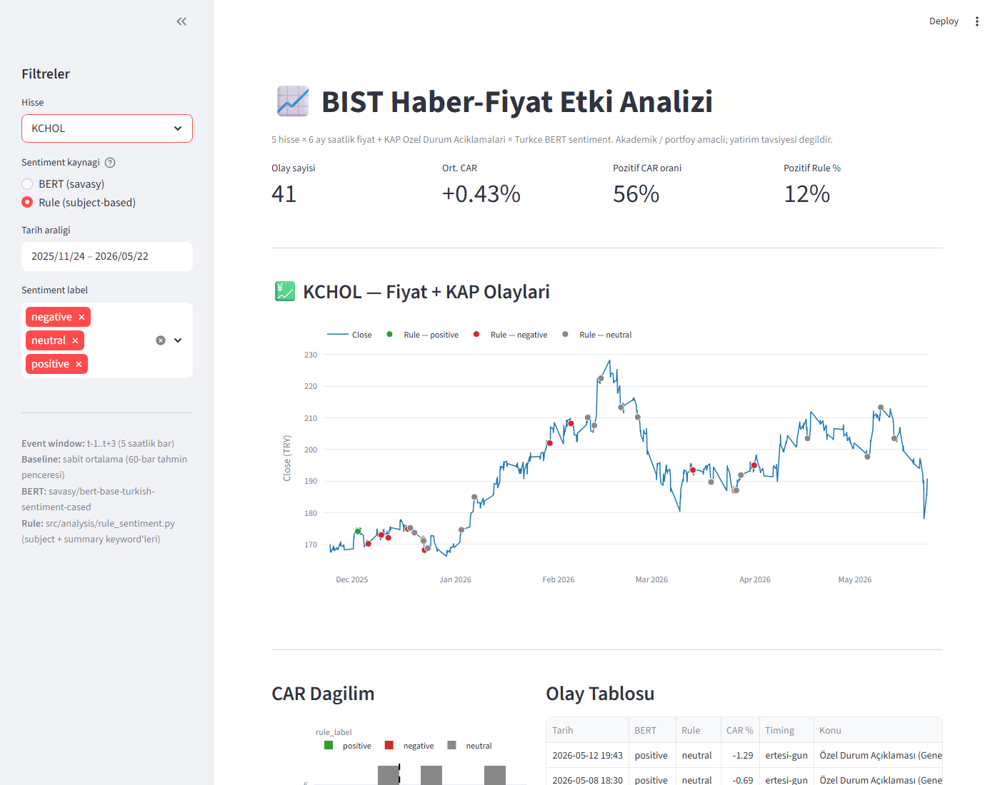

# BIST Haber-Fiyat Etki Analizi

BIST hisseleri için **KAP Özel Durum Açıklamalarının** kısa vadeli fiyat hareketlerine etkisini ölçen bir araştırma projesi. Saatlik fiyat verisi + resmi haber duyurularını birleştirip sentiment skorlarıyla event study analizi yapar.

> **Not:** Akademik / portföy amaçlıdır. Yatırım tavsiyesi değildir.

## Kapsam

| Boyut | Değer |
|---|---|
| Hisseler | THYAO, ASELS, GARAN, KCHOL, EREGL |
| Dönem | Son 6 ay |
| Fiyat granülaritesi | Saatlik (1h) |
| Haber kaynağı | KAP — Özel Durum Açıklamaları (ÖDA) |
| Sentiment modeli | `savasy/bert-base-turkish-sentiment-cased` |

## Mevcut Veri

```
data/raw/prices/   # 5 hisse × 1118 saatlik OHLCV = ~188 KB parquet
data/raw/news/kap/ # 5 hisse × 232 ÖDA bildirim = ~100 KB JSONL
```

Tarih aralığı: 2025-11-24 → 2026-05-22 (son işlem günü).

## Stack

| Katman | Araç |
|---|---|
| Veri işleme | pandas, numpy |
| Fiyat | yfinance |
| Haber | pykap (KAP API wrapper) |
| NLP | HuggingFace Transformers (Türkçe BERT) |
| İstatistik | scipy (t-test, sign test) |
| Görsel | matplotlib, seaborn (notebook); plotly/streamlit *planlı* |
| Test | pytest |

## Dizin Yapısı

```
bist-news-impact/
├── data/
│   ├── raw/
│   │   ├── prices/          # Saatlik fiyat (parquet)
│   │   └── news/kap/        # KAP bildirimleri (JSONL)
│   └── processed/           # İşlenmiş veri (planlı)
├── src/
│   ├── config.py            # TICKERS, BIST_TIMEZONE, dizin yolları
│   ├── data/
│   │   ├── price_fetcher.py # yfinance → parquet
│   │   └── kap_scraper.py   # KAP ÖDA → JSONL
│   └── analysis/
│       ├── loaders.py       # Parquet/JSONL → DataFrame (notebook + analiz ortak)
│       ├── event_study.py   # Pencereleme + AR/CAR (sabit ortalama baseline)
│       ├── sentiment.py     # Türkçe BERT pipeline (savasy/bert-base-turkish-sentiment-cased)
│       └── rule_sentiment.py # Subject-bazlı deterministik sınıflandırma
├── app/
│   └── dashboard.py         # Streamlit dashboard (fiyat + KAP timeline + event study)
├── scripts/
│   └── score_sentiment.py   # KAP bildirimlerini skorla → data/processed/sentiment.parquet
├── tests/                   # 35 birim test
├── notebooks/
│   ├── 01_eda.ipynb         # Keşifsel veri analizi (5 bölüm)
│   ├── 02_event_study.ipynb # Event study (6 bölüm, t-test/sign test)
│   ├── 03_sentiment.ipynb   # BERT sentiment × CAR (6 bölüm, 2×2 alt-grup testi)
│   └── 04_rule_sentiment.ipynb # Rule-based sentiment + BERT vs Rule karşılaştırma
├── docs/
│   └── dashboard.png        # Dashboard ekran goruntusu (README)
├── requirements.txt
└── README.md
```

## Kurulum

```bash
python -m venv venv
venv\Scripts\activate          # Windows
# source venv/bin/activate     # Linux/Mac

pip install -r requirements.txt
```

## Kullanım

```bash
# Saatlik fiyat verisini indir (yfinance)
python -m src.data.price_fetcher

# KAP ÖDA bildirimlerini indir
python -m src.data.kap_scraper

# Testleri çalıştır
pytest tests/ -v

# EDA notebook'unu aç (jupyter veya VS Code)
jupyter notebook notebooks/01_eda.ipynb

# Event study notebook'unu aç
jupyter notebook notebooks/02_event_study.ipynb

# KAP bildirimlerini sentiment'le skorla
python -m scripts.score_sentiment

# Sentiment notebook'unu aç
jupyter notebook notebooks/03_sentiment.ipynb

# Streamlit dashboard'u ayağa kaldır (http://localhost:8501)
streamlit run app/dashboard.py
```

> **Not:** PyTorch CPU sürümü için (`~200 MB`, GPU sürümünden ~10× küçük):
> `pip install --index-url https://download.pytorch.org/whl/cpu torch`

## KAP Veri Toplama — Mühendislik Notu

İlk hedef KAP'ın `bildirim-sorgu` sayfasını doğrudan scrape etmekti. Ancak:

1. **Site Next.js SPA** — veri client-side fetch ile geliyor, HTML'de yok
2. **API endpoint gizli** — Sorgula butonu görünür bir XHR tetiklemiyor
3. **Bot koruması** — `/c44346dd...` üzerinden 307 redirect (Akamai imzası)

Pragmatik çözüm: PyPI'da [`pykap`](https://github.com/cemsinano/pykap) paketinin gerçek API endpoint'ini (`/tr/api/disclosure/members/byCriteria`) sardığını keşfettim. Bu wrapper'ı `BISTCompany.company_id` çözümleyici olarak kullanıp, kendi temiz scraper'ımı (`src/data/kap_scraper.py`) yazdım: `disclosureClass='ODA'` ile ÖDA bildirimlerini çekiyor, Disclosure dataclass'ına normalize edip JSONL kaydediyor.

**Çıkarım:** Reverse-engineering yerine mevcut wrapper kullanmak, 1-2 saatlik bir engineering kararıydı; akademik kalite için ÖDA'nın doğru sınıf olduğunu pykap kodunu okuyarak teyit ettim.

## Veri Şeması

### Fiyat (`data/raw/prices/{TICKER}.parquet`)
- Index: `datetime` (Europe/Istanbul, saatlik)
- Kolonlar: `Open`, `High`, `Low`, `Close`, `Adj Close`, `Volume`

### KAP Bildirim (`data/raw/news/kap/{TICKER}.jsonl`, satır başına 1 bildirim)
```json
{
  "ticker": "THYAO",
  "disclosure_index": 1603784,
  "publish_datetime": "2026-05-08T20:39:08+03:00",
  "subject": "Özel Durum Açıklaması (Genel)",
  "summary": "Nisan 2026 Trafik Sonuçları",
  "disclosure_class": "ODA",
  "disclosure_category": "ODA",
  "stock_codes": "THYAO",
  "attachment_count": 2,
  "url": "https://www.kap.org.tr/tr/Bildirim/1603784"
}
```

## EDA Bulguları

Notebook: [`notebooks/01_eda.ipynb`](notebooks/01_eda.ipynb) — GitHub plot'ları ve tabloları inline render eder.

**1. yfinance bar etiketi — varsayımdan veriye:** BIST sürekli işlemi 10:00–18:00, fakat yfinance saatlik bar etiketleri Istanbul'da **09:30–17:30** olarak gelir (her saatin 30. dakikasında, Yahoo'nun UTC-bazlı bar etiketlemesinin sonucu). Günde 9 bar (1118 satır / 125 işgün = 8.94 doğrulandı). Bar kapsamı `[start, start+1h)`:
- `09:30` bar → 09:30–10:30: pre-opening (09:40–10:00) + ilk 30 dk sürekli işlem
- `10:30..16:30` → sürekli işlem saatleri
- `17:30` bar → 17:30–18:30: son 30 dk işlem + kapanış müzayedesi (18:00–18:10) + nihai kapanış (~18:15) hepsi bu bar'ın `Close`'unda

**2. KAP bildirim zamanlaması (event study tasarımını şekillendirir):** Toplam 232 bildirimin **%81.5'i işlem saatleri dışında** yayınlanıyor (kapanış sonrası ağırlıklı). Bu, event study'de **t+1d (ertesi açılış gap) pencerenin baskın kanal** olacağı anlamına gelir; t±Nh kısa pencere ikincil rolde.

**3. Volatilite & otokorelasyon:** Saatlik vol %0.68–0.87 aralığında (yıllıklandırılmış %32–%41). 1-bar ACF tüm hisseler için `|≤0.07|` sınırı içinde (KCHOL −0.066 en negatif, ASELS +0.008 hafif pozitif) — etkin pazara yakın, hafif mean-reversion eğilimi. Abnormal getiri için sabit ortalama bazlı bir baz model yeterli olabilir (pazar modeli zorunlu değil).

## Event Study Bulguları

Notebook: [`notebooks/02_event_study.ipynb`](notebooks/02_event_study.ipynb). Pencere: `t-1..t+3` saatlik bar (toplam 5 bar). Baseline: olay öncesi 60 bar sabit ortalama (EDA bulgusuna göre pazar modeli gereksiz). **221/232 olay analiz edildi** — 9 olay yetersiz veri, 2 olay data sınırı dışı (%95.3 kapsama).

**1. Toplu CAR anlamlı değil, ama alt-grupta çok anlamlı:** 221 olay birleşik tek-örnek t-testi `t = 1.09, p = 0.28` — yani "KAP bildirimi → CAR ≠ 0" toplu olarak doğrulanmıyor. Ancak **zamanlama alt-grupları kuvvetli ayrışıyor**.

**2. ⭐ Aynı-gün vs Ertesi-gün bar map'i (kuvvetli bulgu):**

| Timing | n | Ort CAR | Std |
|---|---|---|---|
| Aynı-gün bar map | 153 | **−0.14%** | 1.72% |
| Ertesi-gün bar map | 68 | **+0.76%** | 1.98% |

**Welch iki-örnek t-test: `t = −3.23, p = 0.0016`** (≪ 0.01, çok anlamlı). EDA'daki "%81.5 dışarıda" bulgusunun arka tarafı: kapanış-sonrası bildirimler (ertesi-gün maps) **anlamlı pozitif tepki** alıyor; aynı-gün rutin bildirimler **hafif negatif**. İktisadi yorum: kapanış sonrası yapılan duyurular tipik olarak "ağır" haber (rating güncellemeleri, sermaye işlemleri, M&A) — pazar açılışında pozitif fiyatlama.

**3. Hisse bazında p-değerleri:**

| Hisse | n | Ort CAR % | t-test p | Pozitif oranı | Sign test p |
|---|---|---|---|---|---|
| THYAO | 28 | +0.28 | 0.48 | 57% | 0.57 |
| ASELS | 19 | +0.43 | 0.32 | 47% | 1.00 |
| GARAN | 111 | −0.09 | 0.64 | 47% | 0.57 |
| KCHOL | 41 | +0.43 | **0.055** | 56% | 0.53 |
| EREGL | 22 | +0.26 | 0.52 | **82%** | **0.0043** |
| **ALL** | 221 | +0.13 | 0.28 | 53% | 0.35 |

- **EREGL:** olayların %82'si pozitif yönlü tepki (sign test p = 0.0043, çok anlamlı). Büyüklük değişken olduğu için t-testte görünmüyor; **yön tutarlılığı** net.
- **KCHOL:** marjinal anlamlı (t-test p = 0.055), pozitif eğilim.
- **GARAN:** 111 olay (en büyük örneklem) — etki yok, çoğu rutin bildirim.

**4. Sonraki adım için ipuçları:** Sentiment skorlama eklendiğinde "pozitif-skorlu × ertesi-gün maps" alt-grubu büyük olasılıkla en güçlü sinyali verir. Geniş pencere (t+1d, t+5d) ve BIST100 baz model ek doğrulama için denenebilir.

## Sentiment Bulguları

Notebook: [`notebooks/03_sentiment.ipynb`](notebooks/03_sentiment.ipynb). Model: `savasy/bert-base-turkish-sentiment-cased` (HuggingFace, binary positive/negative). 232 KAP bildirimi `summary` metni üzerinden skorlandı (~9 sn CPU). Sonuç `data/processed/sentiment.parquet`'te.

**Label dağılımı dengeli:** 117 pozitif / 115 negatif. Hisse bazında ASELS ve THYAO pozitif-ağırlıklı (16/23, 17/28); KCHOL hafif negatif-ağırlıklı (26/44); GARAN ve EREGL dengeli.

**1. Sentiment CAR'ı predict etmiyor — hatta hafif ters yön:**

| Sentiment | n | Ort CAR % | Std % |
|---|---|---|---|
| Negative | 112 | **+0.27** | 1.78 |
| Positive | 109 | **−0.01** | 1.91 |

Welch t-test: t = −1.12, p = 0.26 (anlamlı değil, **ama yön beklediğimizin tersi**).

**2. ⭐ Anahtar hipotez çürütüldü — sentiment × timing 2×2:**

| | Aynı-gün | Ertesi-gün |
|---|---|---|
| Negative | −0.05% (n=75) | **+0.93% (n=37)** |
| Positive | −0.22% (n=78) | +0.54% (n=31) |

Hipotez: "pozitif × ertesi-gün" en güçlü sinyal olmalı. **Gerçek: "negatif × ertesi-gün" hücresi en yüksek ortalama CAR'a (+0.93%) sahip.** Pozitif × ertesi-gün vs diğer 3 hücre Welch t-test: t = 1.11, p = 0.275 (anlamsız). Yani sentiment etiketinin sinyal kalitesini iyileştirmediğini söyleyebiliriz — **timing tek başına baskın faktör**.

**3. Neden çalışmadı — model domain mismatch:** En yüksek güvenle skorlanan örnek bildirimlere bakınca model davranışı netleşiyor:

- **Pozitif (skor ≥0.99) olarak işaretlenenler:** "Fitch Ratings kredi derecelendirme notları" — model "kredi", "not" gibi kelimeleri pozitif okuyor ama bildirimin yönü (not ↑ mı ↓ mı) içerikten okunmuyor.
- **Negatif (skor ≥0.99) olarak işaretlenenler:** "Üst yönetim değişikliği", "2025 Yılı Kar Dağıtımı", "Tahsili gecikmiş alacak portföy satışı" — bu üç başlık bile finansal bağlamda **nötr veya pozitif** (kar dağıtımı yatırımcı için pozitif; takipteki kredi satışı bilanço temizliği). Model genel-amaçlı ürün yorumu/sosyal medya dilinde eğitildi; "değişiklik", "gecikmiş", "kar" gibi terimleri finansal değil günlük dil anlamıyla işliyor.

**4. Çıkarım:** Genel-amaçlı Türkçe BERT sentiment, KAP ÖDA gibi yapılandırılmış finansal duyuru dili için yetersiz. Anlamlı sentiment sinyali için ya (a) finansal Türkçe corpus üzerinde fine-tune'lu bir model, ya da (b) bildirim **kategorisine** (`disclosure_category`) bağlı kural-bazlı bir yaklaşım (örn. "kar payı dağıtımı" = pozitif, "esas sözleşme değişikliği" = nötr) daha verimli olur. Bu null-result'un kendisi proje için kıymetli: domain-specific NLP gerekliliğini ampirik olarak gösterir. **Sonraki bölüm (b) yaklaşımını uyguluyor.**

## Kural-Bazlı Sentiment ve Karşılaştırma

Notebook: [`notebooks/04_rule_sentiment.ipynb`](notebooks/04_rule_sentiment.ipynb). Modül: `src/analysis/rule_sentiment.py`. 20 farklı KAP `subject` üzerinden deterministik sınıflandırma:

- **Sabit POZ** (4 subject, 28 olay): Kar Payı Dağıtımı, Payların Geri Alınması, Yeni İş İlişkisi, Finansal Duran Varlık Edinimi
- **Sabit NEG** (1 subject, çoğunlukla 0 olay veri setinde): Finansal Duran Varlık Satışı
- **Keyword-bazlı** (3 subject, `summary`'e bakar):
  - Sermaye Artırımı/Azaltımı: "artırım" → NEG (dilution), "azaltım" → POZ
  - Pay Alım Satım: "satış/satım" → NEG (insider sell), "alım/alış" → POZ
  - Kredi Derecelendirmesi: "yukarı/yükseltil" → POZ, "düşürül/aşağı" → NEG
- **Sabit NÖT** (12 subject, çoğunluk): Genel Kurul, İhraç Tavanı, Bağımsız Denetim, vb.
- **Bilinmeyen subject** → NÖT (güvenli default, gelecek kategoriler için)

**Veri setindeki dağılım (221 OK olay):**

| Rule label | n | Ort. CAR % |
|---|---|---|
| positive | 28 | +0.17 |
| neutral | 180 | +0.11 |
| negative | 13 | +0.35 |

Negative örnekleminin tamamı KCHOL'un Tahsisli Sermaye Artırımı + Pay Satışı sürecinin 13 aşaması — tek olayın çoklu bildirimi. Bu küçük örneklemde tesadüfen pozitif CAR'a denk gelmiş (Welch pos-neg p=0.74, anlamsız).

**Rule × Timing 2×3 ızgarası:**

| | Aynı-gün | Ertesi-gün |
|---|---|---|
| Negative | −0.26% (n=7) | +1.06% (n=6) |
| Neutral | −0.11% (n=128) | +0.67% (n=52) |
| Positive | −0.29% (n=18) | **+1.01% (n=10)** |

**⭐ Pozitif × ertesi-gün alt-grubunda 10 olayın 9'u pozitif CAR — sign test p=0.0215.** Örneklem küçük (n=10) olduğu için Welch t-test marjinal (p=0.26), ama yön tutarlılığı dikkate değer.

**BERT vs Rule — karşılaştırma:**

| Yöntem | n pos | n neg | pos ort % | neg ort % | Welch p |
|---|---|---|---|---|---|
| BERT (savasy) | 109 | 112 | −0.01 | +0.27 | 0.26 |
| Rule | 28 | 13 | +0.17 | +0.35 | 0.74 |

İki yöntem **Cohen's kappa = −0.007** — rastgele uyumun bile altında, neredeyse bağımsız sınıflandırma yapıyorlar.

**Disagreement örnekleri (BERT'in ne tür bildirimleri yanlış sınıfladığı):**
- BERT pos + Rule neg (4 olay): hepsi KCHOL'un sermaye artırımı/pay satışı süreci. BERT "tamamlandı/yetkilendirme" gibi terimleri pozitif okuyor.
- BERT neg + Rule pos (18 olay): "Kar Payı Dağıtımı", "Geri Alım", "Yeni İş İlişkisi" başlıklarını BERT yanlış sınıflandırıyor — finansal dil ile günlük dil ayrışması net.

**Final çıkarım:** Rule-based yaklaşım yorumlanabilirlik açısından üstün, küçük alt-gruplarda (pos+ertesi-gün) yön tutarlılığı veriyor (sign test p=0.02), ama ortalama CAR farkı seviyesinde anlamlı sinyal yok. Hem BERT hem rule yöntemiyle ulaşılan sonuç, 5 hisse × 6 ay'lık örneklemde **etkin pazar hipotezine** yakın bir bulgu: KAP bildirimleri sistematik bir CAR sinyali üretmiyor; etki büyük ölçüde **timing (kapanış sonrası → ertesi açılış gap)** kanalı üzerinden, sentiment yönünden bağımsız olarak gerçekleşiyor.

## Streamlit Dashboard

`streamlit run app/dashboard.py` → http://localhost:8501



Tüm analiz sonuçlarının (fiyat + KAP + sentiment + event study) tek sayfada interaktif sunumu:

- **Sidebar:** hisse seçici, tarih aralığı, sentiment label filtresi
- **Üst metrikler:** olay sayısı, ortalama CAR%, pozitif CAR oranı, pozitif sentiment %
- **Fiyat grafiği:** Close çizgisi + KAP olay marker'ları (yeşil pozitif / kırmızı negatif sentiment; hover'da subject + summary + CAR%)
- **CAR dağılım:** sentiment bazında histogram + sortable olay tablosu
- **2×2 ısı haritası:** seçili hissenin Sentiment × Timing × ortalama CAR matrisi

Veri akışı: tüm yüklemeler `@st.cache_data` ile önbelleğe alınır (event study + KAP load ~3 sn ilk açılışta, sonra anlık). Sentiment skorları varsa otomatik join'lenir; yoksa "n/a" olarak gösterilir ve script ipucu verilir.

## Yol Haritası

- [x] **Fiyat toplama** — yfinance, 5 hisse × 6 ay saatlik
- [x] **KAP haber toplama** — ÖDA bildirimleri, 5 hisse × 6 ay (232 bildirim)
- [x] **Birim testler** — 26 test, ağ çağrısı içermez
- [x] **EDA notebook** — getiri dağılımı, volatilite, KAP yoğunluğu, fiyat × haber timeline
- [x] **Event study** — `t-1..t+3` pencere, sabit ortalama baseline, AR/CAR + istatistiksel anlamlılık
- [x] **Türkçe sentiment skorlama** — BERT ile her bildirime polarite (savasy modeli, null-result: domain mismatch tespit edildi)
- [x] **Streamlit dashboard** — fiyat + KAP timeline + sentiment + event study tek sayfada
- [x] **Kural-bazlı sentiment** — KAP subject taksonomisine dayalı deterministik sınıflandırma (BERT vs Rule karşılaştırma; Cohen's kappa = −0.007)

## Test Durumu

```
47 passed in ~1.3s
- tests/test_price_fetcher.py  (4 test)
- tests/test_kap_scraper.py    (6 test)
- tests/test_loaders.py        (6 test)
- tests/test_event_study.py    (10 test)
- tests/test_sentiment.py      (9 test, model mock'lu)
- tests/test_rule_sentiment.py (12 test, saf fonksiyon)
```

## Lisans

MIT
